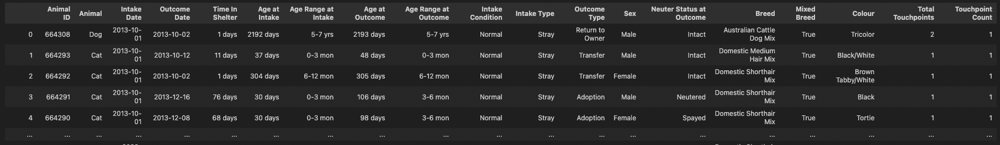

# **A PRELIMINARY ANALYSIS: INCREASING ADOPTION RATES AT THE AUSTIN ANIMAL CENTER**

==By Andrea Messer, Charlotte Schnoebelen, Shamim Munshi, Yana Zykova, Sumaiya Ahmed==

# *Project Intro*
This report outlines the development team’s approach to project delivery, provides insight into our analysis design and implementation strategy, and identifies some high-level findings. The next section summarises background information about animal shelters in the US - including the AAC - then section 3.0 details the project aims and objectives. The report goes on to outline the project specifications and analysis design (section 4.0), and subsequently describes our implementation process and challenges (section 5.0). Next, section 6.0 provides an overview of our data sources before concluding with high-level findings (section 7.0) and recommendations (section 8.0) for next steps. 

# *Installations required*
* `Pip install pandas`
* `Pip install numpy`
* `pip install matplotlib `

# *Required Imports*
* `import requests` - to get data from API
* `import pandas as pd` - to use pandas library for data anlysis and manipulation
* `import numpy as np` - to perform mathematical operations on arrays 
* `import seaborn as sns` - for visulisation
* `import matplotlib.pyplot as plt` - for visulisation
* `import matplotlib.patches as mpatches`
* `import calendar`

# *Methods used*
* Data collecting
* Data cleaning
* Data processing 
* Data analysis
* Data visulisation
  
# *Columns in Dataset*
* Animal ID - this is the ID which is used to identify the animals
* Animal - this is the type of the animal
* Intake Date - the date at which the animal is taken in by the shelter
* Outcome Date - the date at which the animal leaves the shelter
* Time in shelter - The length of time animal has spent in the shelter
* Age at Intake - Age of animal when they were taken in by the shelter
* Age range at intake - The intake age category for the animal
* Age at Outcome - Age of animal when they leave the shelter
* Age range at outcome - the outcome age category for the animal
* Intake condition - the condition of the animal when they were taken in by the shelter
* Intake Type - The type of intake (stray, public assist etc)
* Outcome Type - What the outcome was the animal (Adopted, Returned to owner etc)
* Sex - Sex of the animal - Male or female
* Neuter status at outcome - what was the neuter status when animal left the shelter
* Breed - the breed of the animal
* Mixed Breed - this contains a boolean value, True if animal is a mixed breed and False if it isn't
* Colour - Colour of the animal
* Total touchpoints - The total amount of times the same animal has been returned to the shelter - this was used for dataframe merging
* Touchpoint count - The number of the return to the shelter - 1 = first time at shelter, 2 = second time in shelter etc.

# *Code structure*
##### *Sections 1 - 9 - Data collecting and Data cleaning*
##### *Section 10 - Descriptive analysis*
##### *Section 11 - Time series analysis*

# *Results*
* Adoption rates are affected by the season / month, animal type and characteritstics of the animals.
* Dogs are adopted all year round at the same rate but cats have a decrease in adoptions during the spring.
* Stray or owner surrendered animals are more likely to get adopted than animals of other intake types.
* Neutered or spayed animals have higher adoption rates to animals who are intact. 

